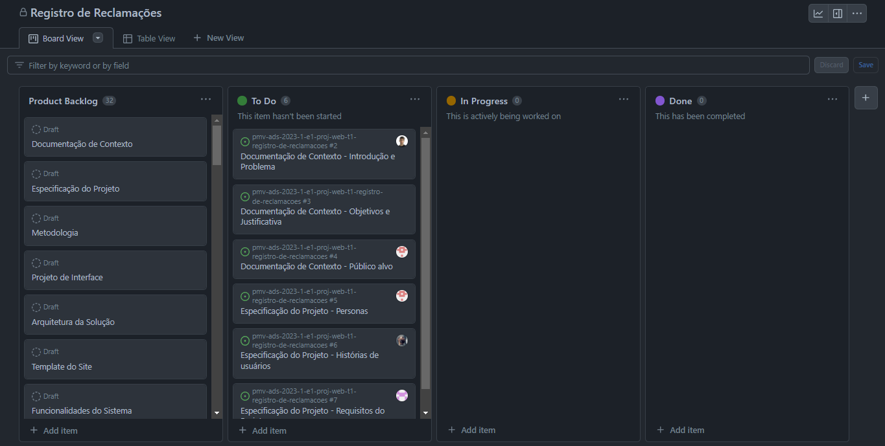
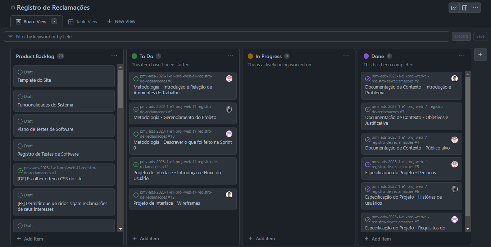
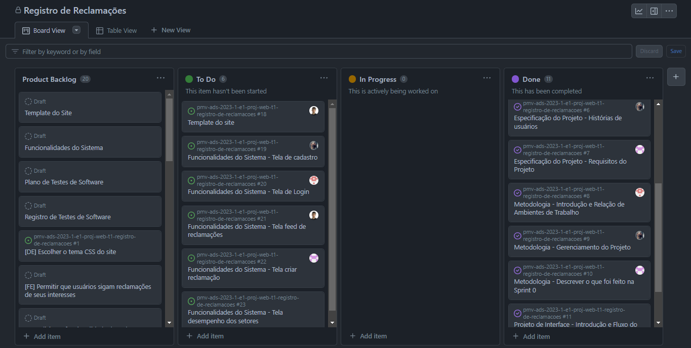

# Metodologia

A metodologia contempla as definições das ferramentas utilizadas pela equipe tanto para a criação e manutenção dos códigos e demais artefatos quanto para a organização do time na execução das tarefas do projeto.

## Relação de Ambientes de Trabalho

Os artefatos do projeto são desenvolvidos a partir de diversas plataformas e a relação dos ambientes com seu respectivo propósito é apresentada na tabela a seguir.

|         AMBIENTE          |        PLATAFORMA         |                  LINK DE ACESSO                               |
|----------------------------|---------------------------|---------------------------------------------------------------|
|Repositório de código fonte |         GitHub            | https://github.com/ICEI-PUC-Minas-PMV-ADS/pmv-ads-2023-1-e1-proj-web-t1-registro-de-reclamacoes
|Documentos do Projeto       |         GitHub            | https://github.com/ICEI-PUC-Minas-PMV-ADS/pmv-ads-2023-1-e1-proj-web-t1-registro-de-reclamacoes/tree/main/docs
|Projeto de Interface e Wireframes|   Figma              | https://www.figma.com/file/vve9yuNV9e0VifPQLMX20w/Registro-de-Reclama%C3%A7%C3%B5es?node-id=0%3A1&t=kguw5qCGXBw67vTB-1    
|Gerenciamento do Projeto     | GitHub Projects          | https://github.com/orgs/ICEI-PUC-Minas-PMV-ADS/projects/311/views/1

## Gerenciamento de Projeto

A equipe utiliza metodologias ágeis, tendo escolhido o Scrum como base para definição do
processo de desenvolvimento.

A equipe está organizada da seguinte maneira:

* Scrum Master: Lucas Lousada Batalha dos Santos
* Product Owner: Felipe Alexandre da Silva
* Equipe de Desenvolvimento:
    * João Victor Bragança
    * Danilo Marques da Fonseca
* Equipe de Design: Matheus Vitor Lourenço

Para organização e distribuição das tarefas do projeto, a equipe está utilizando o GitHub Project estruturado com as seguintes colunas:

  *  Backlog: recebe as tarefas a serem trabalhadas e representa o Product Backlog. Todas as atividades identificadas no decorrer do projeto também devem ser incorporadas a esta lista.
  * To Do: Esta lista representa o Sprint Backlog. Este é o Sprint atual que estamos trabalhando.
  * In progress: Quando uma tarefa tiver sido iniciada, ela é movida para cá.
  * Done: nesta lista são colocadas as tarefas que passaram pelos testes e controle de qualidade e estão prontos para ser entregues ao usuário. Não há mais edições ou     revisões necessárias, ele está agendado e pronto para a ação.

O quadro kanban do grupo desenvolvido na ferramenta de gerenciamento de projetos está
disponível através da URL https://github.com/orgs/ICEI-PUC-Minas-PMV-ADS/projects/311/views/1.

| 
|:--:| 
| *Figura 1 - Quadro Scrum referente a primeira etapa do projeto* |

Na primeira etapa do projeto foi realizado um levantamento dos principais problemas relacionados à gestão pública a fim de realizar uma melhor alocação dos recursos com vistas à uma melhor satisfação da população. 

Para isso foram realizadas entrevistas para coletar relatos e informações relevantes que possam contribuir para a melhoria do processo como um todo com base na experiência do usuário.

Os detalhes levantados nesse processo foram organizados na forma de personas e histórias de usuários.
Para gerenciar todo o processo decidiu-se criar um site com ferramentas que possibilitem a interação entre usuários e o setor público responsável com vistas à solução mais adequada ao problema. 

Para isso foram estabelecidos requisitos funcionais e não funcionais com suas respectivas prioridades, além das restrições que limitam a execução deste projeto e que se configuram como obrigações claras para o seu desenvolvimento.

| 
|:--:| 
| *Figura 2 - Quadro Scrum referente a segunda etapa do projeto* |

Na segunda etapa, estabelecemos a metodologia a ser adotada no projeto, incluindo a localização de nosso repositório, documentos do projeto, projeto de interface e wireframes, bem como a ferramenta a ser usada para gerenciar o projeto.

Ademais, determinamos os papéis de cada membro da equipe dentro da metodologia Scrum, além de definir os padrões a serem aplicados no gerenciamento do projeto no Github Projet.

Elaboramos o projeto de interface, definindo o fluxo do usuário no uso da aplicação, bem como criando todos os protótipos das telas do sistema.

| 
|:--:| 
| *Figura 3 - Quadro Scrum referente a terceira etapa do projeto* |

Na terceira etapa, criamos o template do site, que estabelece o layout padrão a ser utilizado em todas as páginas, juntamente com a definição da identidade visual e da iconografia.

Além disso, demos início ao desenvolvimento das páginas "feed de reclamações", "login" e "recuperar senha", criando toda a estrutura HTML e CSS.