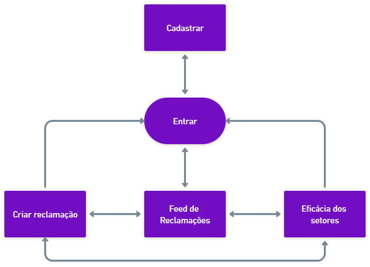
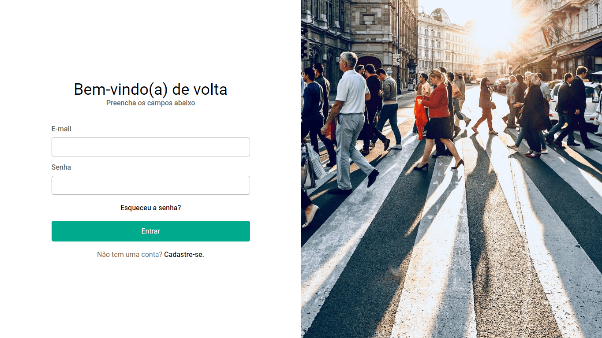
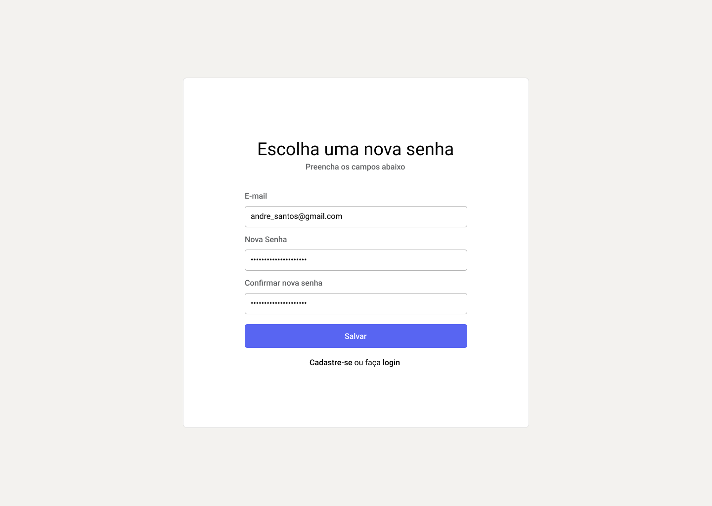
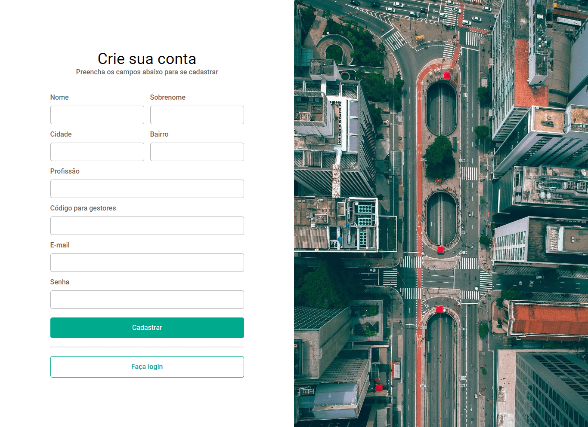
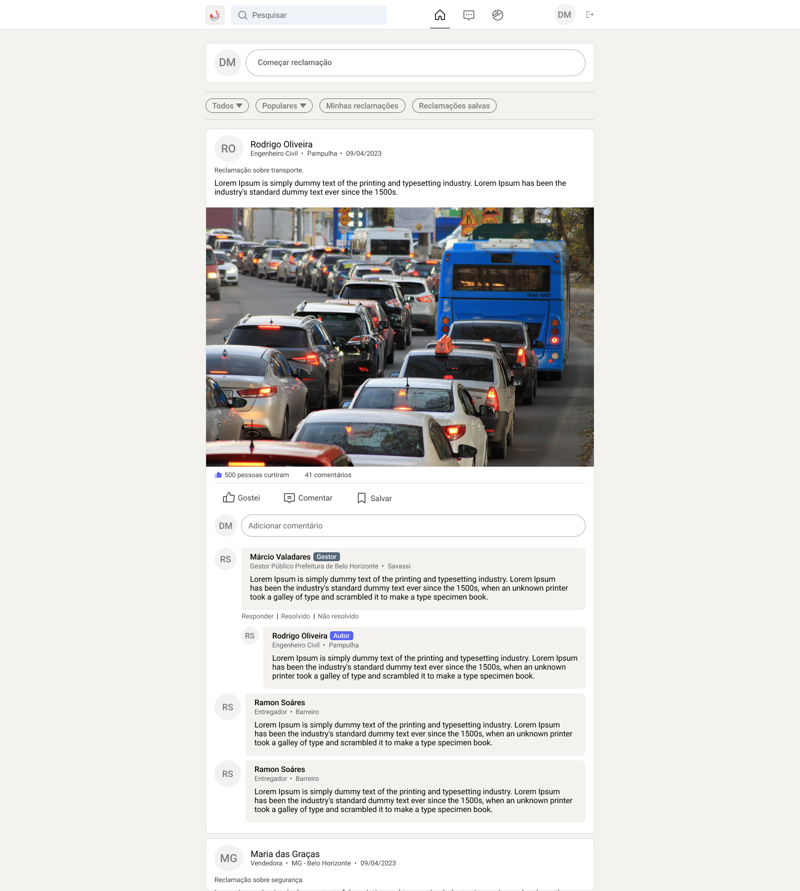
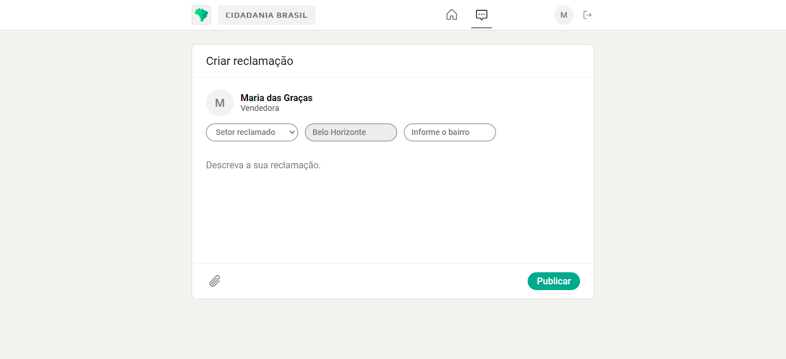

# Projeto de Interface

Estamos dando foco a diversas questões durante a criação da interface do sistema, incluindo agilidade, acessibilidade e usabilidade. Esses aspectos estão sendo cuidadosamente considerados para garantir que o projeto tenha uma identidade visual consistente em todas as telas, tanto para desktops quanto para dispositivos móveis.

## Fluxo do Usuário

O fluxograma representado na Figura 4 mostra o fluxo de interação do usuário pelas telas do
sistema. Cada um dos elementos deste fluxo é detalhado na seção de Wireframes que se segue.

| 
|:--:| 
| *Figura 6 - Fluxo do usuário* |

## Wireframes

Conforme fluxo de telas do projeto, apresentado no item anterior, as telas do sistema são
apresentadas em detalhes nos itens que se seguem.

### Tela - Login

A tela de login é onde o usuário pode entrar em sua conta ou ser redirecionado para criar uma, para posteriormente utilizar a aplicação.

| 
|:--:| 
| *Figura 7 - Tela para o Login do Usuário* |

### Tela - Recuperar senha

A tela de recuperação de senha é onde o usuário pode redefinir a sua senha.

| 
|:--:| 
| *Figura 8 - Tela para recuperação de senha* |

### Tela - Criar conta

A tela criar conta é onde o usuário pode criar sua conta ou ser redirecionado para entrar em uma, para posteriormente utilizar a aplicação.

| 
|:--:| 
| *Figura 9 - Tela para o Cadastro do Usuário* |

### Tela - Feed de Reclamações

A tela de feed de reclamações exibe todas as reclamações criadas pelos usuários. Os usuários têm a opção de curtir e comentar uma reclamação. Além disso, os usuários gestores têm a capacidade de criar réplicas por meio da seção de comentários.

| 
|:--:| 
| *Figura 10 - Tela de Feed de Reclamações* |

### Tela - Criar uma reclamação

A tela de criação de reclamações é onde o usuário pode registrar uma reclamação descrevendo o problema, anexando imagem, selecionando o setor responsável pela reclamação e informando o bairro onde ocorre.

| 
|:--:| 
| *Figura 11 - Tela para Criar uma reclamação* |