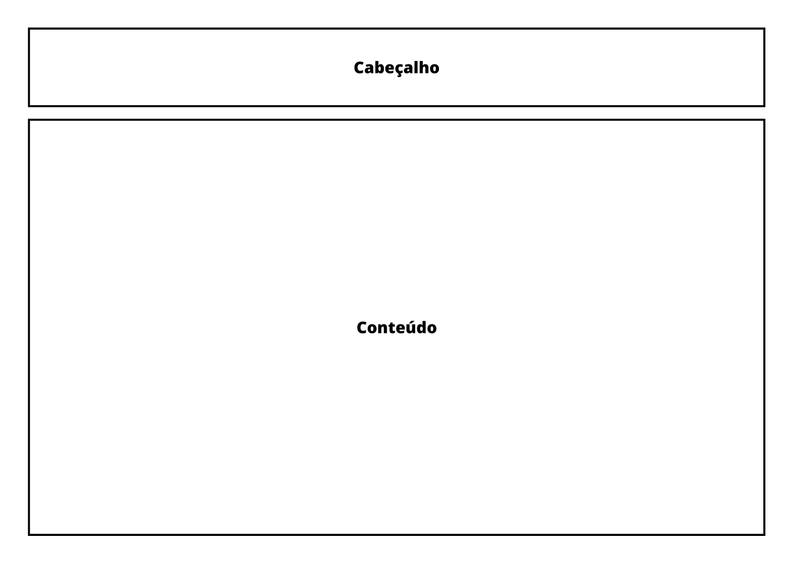
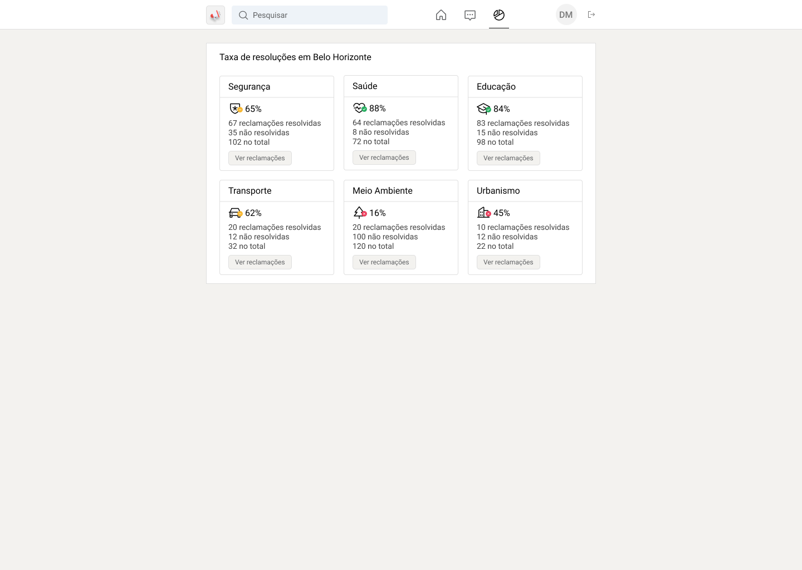

# Projeto de Interface

Dentre as preocupações para a montagem da interface do sistema, estamos estabelecendo
foco em questões como agilidade, acessibilidade e usabilidade. Desta forma, o projeto tem
uma identidade visual padronizada em todas as telas que são projetadas para funcionamento
em desktops e dispositivos móveis.

## Fluxo do Usuário

O diagrama apresentado na Figura X mostra o fluxo de interação do usuário pelas telas do
sistema. Cada uma das telas deste fluxo é detalhada na seção de Wireframes que se segue.
Para visualizar o wireframe interativo, acesse o ambiente MarvelApp do projeto.

## Wireframes

Conforme fluxo de telas do projeto, apresentado no item anterior, as telas do sistema são
apresentadas em detalhes nos itens que se seguem. As telas do sistema apresentam uma
estrutura comum que é apresentada na Figura 1. Nesta estrutura, existem 2 grandes blocos,
descritos a seguir. São eles:

- Cabeçalho - local onde são dispostos elementos fixos de identidade (logo), navegação principal do site (menu da aplicação), barra de busca, ícone do usuário logado e o botão para efetuar o logout;
- Conteúdo - apresenta o conteúdo da tela em questão;

| 
|:--:| 
| *Figura 1 - Estrutura padrão do site* |

### Tela - Login

A tela de login é onde o usuário pode entrar em sua conta ou ser redirecionado para criar uma, para posteriormente utilizar a aplicação.

| 
|:--:| 
| *Figura 2 - Tela para o Login do Usuário* |

### Tela - Criar conta

A tela criar conta é onde o usuário pode criar sua conta ou ser redirecionado para entrar em uma, para posteriormente utilizar a aplicação.

| 
|:--:| 
| *Figura 3 - Tela para o Cadastro do Usuário* |

### Tela - Feed de Reclamações

A tela de feed de reclamações exibe todas as reclamações criadas pelos usuários. O gestor tem permissão para criar comentários, enquanto o autor da reclamação pode responder a eles ou encerrar a reclamação. O usuário pode interagir com as reclamações de diversas maneiras, como curtir, comentar e salvar. Além disso, é possível filtrá-las por meio das seguintes opções:

  - Palavras-chave, por meio da barra de busca;
  - Setor reclamado;
  - Ordenar por mais recentes e mais populares;
  - Ver apenas as próprias reclamações;
  - Ver as reclamações salvas.

| 
|:--:| 
| *Figura 4 - Tela de Feed de Reclamações* |

### Tela - Criar uma reclamação

A tela de criação de reclamações é onde o usuário pode registrar uma reclamação descrevendo o problema, anexando imagens relevantes, selecionando o setor responsável pela reclamação e informando o bairro onde ocorre.

| 
|:--:| 
| *Figura 5 - Tela para Criar uma reclamação* |

### Tela - Eficiência dos Setores Reclamados

A tela de eficiência dos setores reclamados é onde o usuário pode verificar a eficácia de cada setor onde as reclamações foram registradas.

| 
|:--:| 
| *Figura 6 - Tela de Eficiência dos Setores Reclamados* |