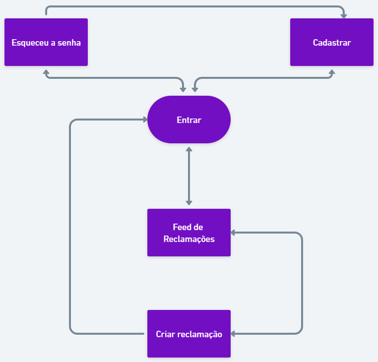
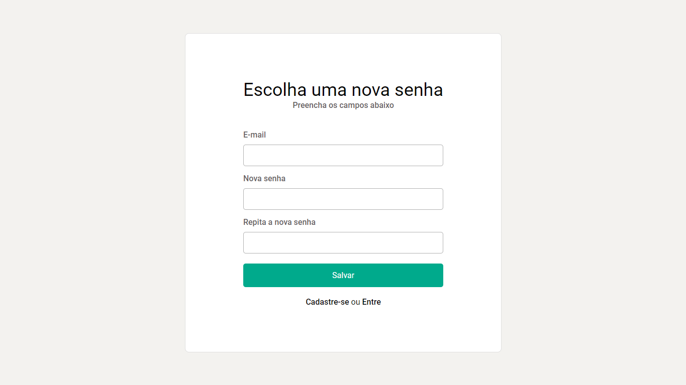
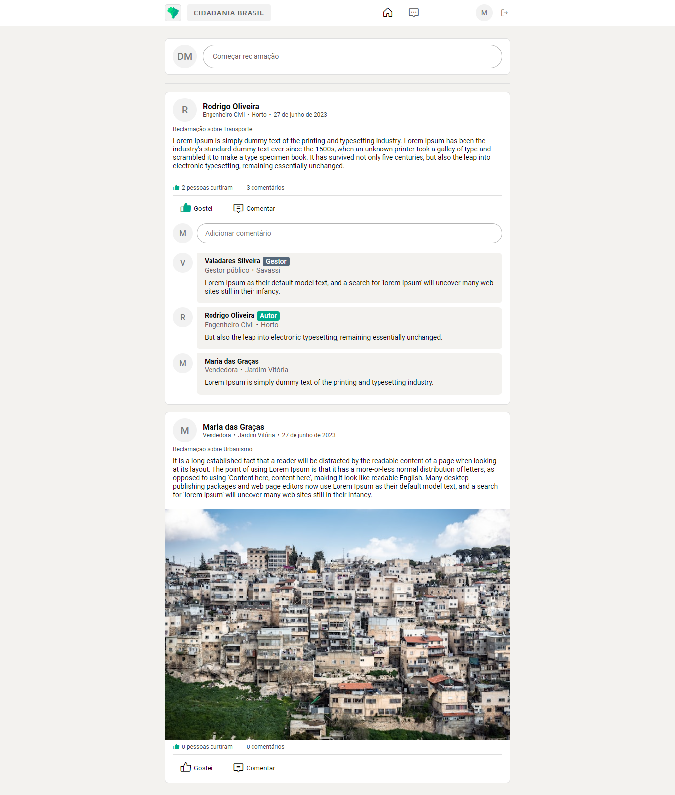

# Projeto de Interface

Estamos dando foco a diversas questões durante a criação da interface do sistema, incluindo agilidade, acessibilidade e usabilidade. Esses aspectos estão sendo cuidadosamente considerados para garantir que o projeto tenha uma identidade visual consistente em todas as telas, tanto para desktops quanto para dispositivos móveis.

## Fluxo do Usuário

O fluxograma representado na Figura 4 mostra o fluxo de interação do usuário pelas telas do
sistema. Cada um dos elementos deste fluxo é detalhado na seção de Wireframes que se segue.

| 
|:--:| 
| *Figura 4 - Fluxo do usuário* |

## Wireframes

Conforme fluxo de telas do projeto, apresentado no item anterior, as telas do sistema são
apresentadas em detalhes nos itens que se seguem. As telas do sistema apresentam uma
estrutura comum que é apresentada na Figura 5. Nesta estrutura, existem 2 grandes blocos,
descritos a seguir. São eles:

- Cabeçalho - local onde são dispostos elementos fixos de identidade (logo), navegação principal do site (menu da aplicação), barra de busca, ícone do usuário logado e o botão para efetuar o logout;
- Conteúdo - apresenta o conteúdo da tela em questão;

| 
|:--:| 
| *Figura 5 - Estrutura padrão do site* |

### Tela - Login

A tela de login é onde o usuário pode entrar em sua conta ou ser redirecionado para criar uma, para posteriormente utilizar a aplicação.

| 
|:--:| 
| *Figura 6 - Tela para o Login do Usuário* |

### Tela - Recuperar senha

A tela de recuperação de senha é onde o usuário pode redefinir a sua senha.

| 
|:--:| 
| *Figura 7 - Tela para recuperação de senha* |

### Tela - Criar conta

A tela criar conta é onde o usuário pode criar sua conta ou ser redirecionado para entrar em uma, para posteriormente utilizar a aplicação.

| 
|:--:| 
| *Figura 8 - Tela para o Cadastro do Usuário* |

### Tela - Feed de Reclamações

A tela de feed de reclamações exibe todas as reclamações criadas pelos usuários. O gestor tem permissão para criar comentários, enquanto o autor da reclamação pode responder a eles ou encerrar a reclamação. O usuário pode interagir com as reclamações de diversas maneiras, como curtir, comentar e salvar. Além disso, é possível filtrá-las por meio das seguintes opções:

  - Palavras-chave, por meio da barra de busca;
  - Setor reclamado;
  - Ordenar por mais recentes ou mais populares;
  - Ver apenas as próprias reclamações;
  - Ver as reclamações salvas.

| 
|:--:| 
| *Figura 9 - Tela de Feed de Reclamações* |

### Tela - Criar uma reclamação

A tela de criação de reclamações é onde o usuário pode registrar uma reclamação descrevendo o problema, anexando imagens relevantes, selecionando o setor responsável pela reclamação e informando o bairro onde ocorre.

| 
|:--:| 
| *Figura 10 - Tela para Criar uma reclamação* |

### Tela - Eficiência dos Setores Reclamados

A tela de eficiência dos setores reclamados é onde o usuário pode verificar a eficácia de cada setor onde as reclamações foram registradas.

| 
|:--:| 
| *Figura 11 - Tela de Eficiência dos Setores Reclamados* |