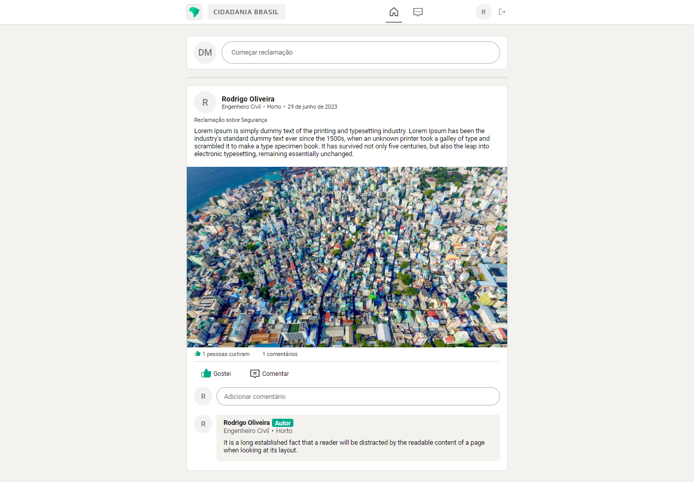

# Registro de Testes de Software

Os resultados obtidos nos testes de software realizados são descritos abaixo.

| **Caso de Teste** | **CT-001 – Cadastro do usuário** 	|
|:---:	|:---:	|
| **Usuário 1**  	| O usuário se cadastrou sem preencher o campo código de gestor, logo ele foi cadastrado como um usuário comum. Por fim, ele foi direcionado para a tela de Login. 	 |
| **Quantidade de erros**  	| 0 |
| **Comentários e observações**  | O usuário achou a tela intuitiva e não encontrou dificuldades para preencher os dados.  |

|
|:--:|
|_Teste do usuário 1 na tela cadastro._ |

  

| **Caso de Teste** | **CT-001 – Cadastro do usuário** 	|
|:---:	|:---:	|
| **Usuário 2**  	| O usuário não conseguiu se cadastrar. 	 |
| **Quantidade de erros**  	| 0 |
| **Comentários e observações**  | O usuário deixou um ou mais campos obrigatórios sem preenchimento. Uma mensagem foi exibida para o usuário informado sobre o problema.  |

|
|:--:|
|_Teste do usuário 2 na tela cadastro._ |

  

| **Caso de Teste** | **CT-001 – Cadastro do usuário** 	|
|:---:	|:---:	|
| **Usuário 3** | O usuário não conseguiu se cadastrar. |
| **Quantidade de erros**  	| 0 |
| **Comentários e observações**  | O usuário informou uma senha com menos de 8 caracteres. Uma mensagem foi exibida para o usuário informado sobre o problema.  |

|
|:--:|
|_Teste do usuário 3 na tela cadastro._ |

  

| **Caso de Teste** | **CT-001 – Cadastro do usuário** 	|
|:---:	|:---:	|
| **Usuário 4** | O usuário se cadastrou preenchendo o campo código de gestor, logo ele foi cadastrado como um usuário gestor. Por fim, ele foi direcionado para a tela de Login. 	 |
| **Quantidade de erros**  	| 0 |
| **Comentários e observações**  | O usuário achou a tela intuitiva e não encontrou dificuldades para preencher os dados.  |

|
|:--:|
|_Teste do usuário 4 na tela cadastro._ |

  

| **Caso de Teste** | **CT-001 – Cadastro do usuário** 	|
|:---:	|:---:	|
| **Usuário 5** | O usuário não conseguiu se cadastrar. 	|
| **Quantidade de erros**  	| 0 |
| **Comentários e observações**  | O usuário informou um código de gestor inválido. Uma mensagem foi exibida para o usuário informado sobre o problema.  |

|
|:--:|
|_Teste do usuário 5 na tela cadastro._ |

  

| **Caso de Teste** | **CT-001 – Cadastro do usuário** 	|
|:---:	|:---:	|
| **Usuário 6** | O usuário não conseguiu se cadastrar. 	|
| **Quantidade de erros**  	| 0 |
| **Comentários e observações**  | O usuário informou um e-mail já cadastrado. Uma mensagem foi exibida para o usuário informado sobre o problema.  |

|
|:--:|
|_Teste do usuário 6 na tela cadastro._ |

  

| **Caso de Teste** | **CT-002 – Login** 	|
|:---:	|:---:	|
| **Usuário 1** | O usuário conseguiu se cadastrar. |
| **Quantidade de erros**  	| 0 |
| **Comentários e observações**  | O usuário achou a tela intuitiva e não encontrou dificuldades para preencher os dados.  |

|
|:--:|
|_Teste do usuário 1 na tela de login._ |

  

| **Caso de Teste** | **CT-002 – Login** 	|
|:---:	|:---:	|
| **Usuário 2** | O usuário não conseguiu se cadastrar. |
| **Quantidade de erros**  	| 0 |
| **Comentários e observações**  | O usuário informou um e-mail inválido. Uma mensagem foi exibida para o usuário informado sobre o problema. |

|
|:--:|
|_Teste do usuário 2 na tela de login._ |

  

| **Caso de Teste** | **CT-002 – Login** 	|
|:---:	|:---:	|
| **Usuário 3** | O usuário não conseguiu se cadastrar. |
| **Quantidade de erros**  	| 0 |
| **Comentários e observações**  | O usuário informou um e-mail que não está vinculado a nenhuma conta. Uma mensagem foi exibida para o usuário informado sobre o problema. |

|
|:--:|
|_Teste do usuário 3 na tela de login._ |

  

| **Caso de Teste** | **CT-002 – Login** 	|
|:---:	|:---:	|
| **Usuário 4** | O usuário não conseguiu se cadastrar. |
| **Quantidade de erros**  	| 0 |
| **Comentários e observações**  | O usuário informou uma senha com menos de 8 caracteres. Uma mensagem foi exibida para o usuário informado sobre o problema. |

|
|:--:|
|_Teste do usuário 4 na tela de login._ |

  

| **Caso de Teste** | **CT-002 – Login** 	|
|:---:	|:---:	|
| **Usuário 5** | O usuário não conseguiu se cadastrar. |
| **Quantidade de erros**  	| 0 |
| **Comentários e observações**  | O usuário informou uma senha incorreta. Uma mensagem foi exibida para o usuário informado sobre o problema. |

|
|:--:|
|_Teste do usuário 5 na tela de login._ |

  

| **Caso de Teste** | **CT-002 – Login** 	|
|:---:	|:---:	|
| **Usuário 6** | O usuário não conseguiu se cadastrar. |
| **Quantidade de erros**  	| 0 |
| **Comentários e observações**  | O usuário deixou um ou mais campos obrigatórios sem preenchimento. Uma mensagem foi exibida para o usuário informado sobre o problema. |

|
|:--:|
|_Teste do usuário 6 na tela de login._ |

  

| **Caso de Teste** | **CT-003 – Recuperar senha** 	|
|:---:	|:---:	|
| **Usuário 1** | O usuário conseguiu alterar sua senha. |
| **Quantidade de erros**  	| 0 |
| **Comentários e observações**  | O usuário achou a tela intuitiva e não encontrou dificuldades para preencher os dados. |

|
|:--:|
|_Teste do usuário 1 na tela de recuperação de senha._ |

  

| **Caso de Teste** | **CT-003 – Recuperar senha** 	|
|:---:	|:---:	|
| **Usuário 2** | O usuário não conseguiu alterar sua senha. |
| **Quantidade de erros**  	| 0 |
| **Comentários e observações**  | O usuário informou um e-mail inválido. Uma mensagem foi exibida para o usuário informado sobre o problema. |

|
|:--:|
|_Teste do usuário 2 na tela de recuperação de senha._ |

  

| **Caso de Teste** | **CT-003 – Recuperar senha** 	|
|:---:	|:---:	|
| **Usuário 3** | O usuário não conseguiu alterar sua senha. |
| **Quantidade de erros**  	| 0 |
| **Comentários e observações**  | O usuário informou um e-mail que não está vinculado a nenhuma conta. Uma mensagem foi exibida para o usuário informado sobre o problema. |

|
|:--:|
|_Teste do usuário 3 na tela de recuperação de senha._ |

  

| **Caso de Teste** | **CT-003 – Recuperar senha** 	|
|:---:	|:---:	|
| **Usuário 4** | O usuário não conseguiu alterar sua senha. |
| **Quantidade de erros**  	| 0 |
| **Comentários e observações**  | O usuário informou uma senha com menos de 8 caracteres. Uma mensagem foi exibida para o usuário informado sobre o problema. |

|
|:--:|
|_Teste do usuário 4 na tela de recuperação de senha._ |

  

| **Caso de Teste** | **CT-003 – Recuperar senha** 	|
|:---:	|:---:	|
| **Usuário 5** | O usuário não conseguiu alterar sua senha. |
| **Quantidade de erros**  	| 0 |
| **Comentários e observações**  | O usuário deixou um ou mais campos obrigatórios sem preenchimento. Uma mensagem foi exibida para o usuário informado sobre o problema. |

|
|:--:|
|_Teste do usuário 5 na tela de recuperação de senha._ |

  

| **Caso de Teste** | **CT-003 – Recuperar senha** 	|
|:---:	|:---:	|
| **Usuário 6** | O usuário não conseguiu alterar sua senha. |
| **Quantidade de erros**  	| 0 |
| **Comentários e observações**  | O usuário digitou senhas diferentes. Uma mensagem foi exibida para o usuário informado sobre o problema. |

|
|:--:|
|_Teste do usuário 6 na tela de recuperação de senha._ |

  

| **Caso de Teste** | **CT-004 – Cadastrar uma reclamação** 	|
|:---:	|:---:	|
| **Usuário 1** | O usuário conseguiu cadastrar uma reclamação. |
| **Quantidade de erros** | 0 |
| **Comentários e observações**  | O usuário achou a tela intuitiva e não encontrou dificuldades para preencher os dados. |

|
|:--:|
|_Teste do usuário 1 na tela criar reclamação._ |

  

| **Caso de Teste** | **CT-004 – Cadastrar uma reclamação** 	|
|:---:	|:---:	|
| **Usuário 2** | O usuário não conseguiu cadastrar uma reclamação. |
| **Quantidade de erros** | 0 |
| **Comentários e observações**  | O usuário deixou um ou mais campos obrigatórios sem preenchimento. Uma mensagem foi exibida para o usuário informado sobre o problema. |

|
|:--:|
|_Teste do usuário 2 na tela criar reclamação._ |

  

| **Caso de Teste** | **CT-005 – Curtir uma reclamação** 	|
|:---:	|:---:	|
| **Usuário 1** | O usuário conseguiu curtir uma reclamação. |
| **Quantidade de erros** | 0 |
| **Comentários e observações**  | O usuário achou a tela intuitiva e não encontrou dificuldades para realizar a ação. |

|
|:--:|
|_Teste de curtida do usuário 1 na tela feed de reclamações._ |

  

| **Caso de Teste** | **CT-006 – Comentar em uma reclamação** 	|
|:---:	|:---:	|
| **Usuário 1** | O usuário conseguiu comentar em uma reclamação. |
| **Quantidade de erros** | 0 |
| **Comentários e observações**  | O usuário achou a tela intuitiva e não encontrou dificuldades para realizar a ação. |

|
|:--:|
|_Teste de comentário do usuário 1 na tela feed de reclamações._ |

  

| **Caso de Teste** | **CT-006 – Comentar em uma reclamação** 	|
|:---:	|:---:	|
| **Usuário 2** | O usuário não conseguiu comentar em uma reclamação. |
| **Quantidade de erros** | 0 |
| **Comentários e observações**  | O usuário deixou o campo vazio. Uma mensagem foi exibida para o usuário informado sobre o problema. |

|
|:--:|
|_Teste de comentário do usuário 2 na tela feed de reclamações._ |

  

| **Caso de Teste** | **CT-007 – Visualizar detalhes de uma reclamação** 	|
|:---:	|:---:	|
| **Usuário 1** | O usuário conseguiu visualizar uma reclamação. |
| **Quantidade de erros** | 0 |
| **Comentários e observações**  | O usuário achou a tela intuitiva e não encontrou dificuldades para realizar a ação. |

|
|:--:|
|_Teste de visualização de reclamações do usuário 1 na tela feed de reclamações._ |

  

| **Caso de Teste** | **CT-008 – Visualizar comentários de uma reclamação** 	|
|:---:	|:---:	|
| **Usuário 1** | O usuário conseguiu visualizar os comentários das reclamações. |
| **Quantidade de erros** | 0 |
| **Comentários e observações**  | O usuário achou a tela intuitiva e não encontrou dificuldades para realizar a ação. |

|
|:--:|
|_Teste de visualização dos comentários do usuário 1 na tela feed de reclamações._ |

  

| **Caso de Teste** | **CT-009 – Réplica do setor responsável pela reclamação** 	|
|:---:	|:---:	|
| **Usuário 1** | O usuário gestor conseguiu postar sua réplica nos comentários da reclamação. |
| **Quantidade de erros** | 0 |
| **Comentários e observações**  | O usuário achou a tela intuitiva e não encontrou dificuldades para realizar a ação. |

|
|:--:|
|_Teste de réplica do gestor do usuário 1 na tela feed de reclamações._ |

| **Caso de Teste** | **CT-009 – Réplica do setor responsável pela reclamação** 	|
|:---:	|:---:	|
| **Usuário 2** | O usuário não gestor conseguiu postar sua réplica nos comentários da reclamação. |
| **Quantidade de erros** | 0 |
| **Comentários e observações**  | O usuário deixou o campo vazio. Uma mensagem foi exibida para o usuário informado sobre o problema. |

|
|:--:|
|_Teste de réplica do gestor do usuário 2 na tela feed de reclamações._ |